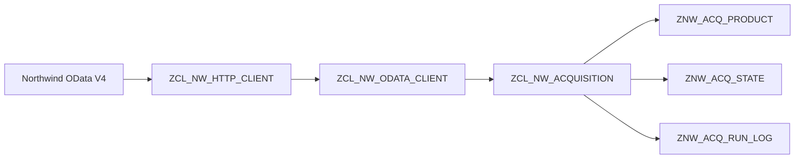

# ABAP Cloud OData Acquisition
A small ABAP Cloud project that demonstrates a resilient data-acquisition
pipeline for an external OData V4 source.

The project reads the public Northwind `Products` entity set, persists a local
snapshot, detects changes between source and target snapshots, tracks
acquisition runs, handles failures, reconciles interrupted runs, performs
automatic retries, and prevents concurrent acquisition of the same source.

The project was developed and tested in SAP BTP ABAP Environment / ABAP Cloud.

---

## Overview

The external source is the public Northwind OData V4 service:

`https://services.odata.org/V4/Northwind/Northwind.svc/`

The project currently works with the `Products` entity set.

The acquisition flow is intentionally split into several layers:

### Main responsibilities

- `ZCL_NW_HTTP_CLIENT`
  - low-level HTTP GET
  - HTTP status handling
  - conversion of technical HTTP errors into project-specific exceptions

- `ZCL_NW_ODATA_CLIENT`
  - OData request construction
  - JSON deserialization
  - paging via `@odata.nextLink`
  - mapping external OData data into an ABAP business structure

- `ZCL_NW_ACQUISITION`
  - snapshot persistence
  - snapshot comparison
  - transaction handling
  - run admission
  - operational state management
  - reconciliation of interrupted runs
  - retry handling
 
- `ZCL_NW_RUN`
  - normal orchestration entry point

## Data model

The project uses three persistence tables.

### `ZNW_ACQ_PRODUCT`

Stores the currently persisted source snapshot.

Main fields:

- `PRODUCT_ID`
- `PRODUCT_NAME`
- `UNIT_PRICE`

The table represents the acquisition layer and therefore reflects the current
source snapshot.

### `ZNW_ACQ_STATE`

Stores the current operational state of a source.

Important fields:

- `SOURCE_NAME`
- `LOAD_TYPE`
- `STATUS`
- `ACTIVE_RUN_ID`
- `LAST_SUCCESS_AT`
- `ROW_COUNT`

There is one operational state row per source.

### `ZNW_ACQ_RUN_LOG`

Stores the history of individual acquisition runs.

Important fields:

- `RUN_ID`
- `SOURCE_NAME`
- `LOAD_TYPE`
- `STATUS`
- `STARTED_AT`
- `FINISHED_AT`
- `ROW_COUNT`
- `NEW_COUNT`
- `CHANGED_COUNT`
- `DELETED_COUNT`
- `ERROR_TEXT`
- `ORIGINAL_RUN_ID`
- `RETRY_COUNT`

`ZNW_ACQ_STATE` describes the current state of a source, while
`ZNW_ACQ_RUN_LOG` describes what happened to individual runs.

These two concepts are intentionally kept separate.

---

## Acquisition strategies

### Full snapshot replacement

`FULL_LOAD_REPLACE`

The complete `Products` entity set is read and the persisted snapshot is
replaced using a simple `DELETE + INSERT` approach.

This method is kept as a reference implementation.

### Full snapshot comparison

`FULL_LOAD_COMPARE`

The complete source snapshot is read and compared with the persisted target
snapshot.

Detected changes are classified as:

- new
- changed
- deleted
- unchanged

Only required database changes are applied.

Important: this is **target-side change detection**, not source-side delta
extraction.

The complete OData entity set is still read from the source, so the approach
reduces database changes but does not reduce API data volume.

