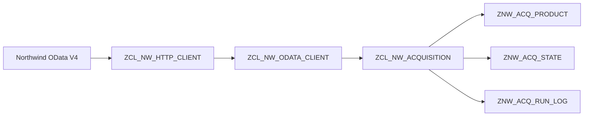

# ABAP Cloud OData Acquisition
A small ABAP Cloud project that demonstrates a resilient data-acquisition
pipeline for an external OData V4 source.

The project reads the public Northwind `Products` entity set, persists a local
snapshot, detects changes between source and target snapshots, tracks
acquisition runs, handles failures, reconciles interrupted runs, performs
automatic retries, and prevents concurrent acquisition of the same source.

The project was developed and tested in SAP BTP ABAP Environment / ABAP Cloud.

## Purpose

This repository is an educational and portfolio project demonstrating
practical ABAP Cloud data-acquisition design.

The project intentionally goes beyond a simple "read OData and insert rows"
example.

Its main focus is the operational behavior around data acquisition: what
happens when a run fails, stops halfway, is retried, collides with another
run, or succeeds while logging later fails.

The project covers OData acquisition, persistence, transaction boundaries,
run-state management, reconciliation, retries, concurrency protection, and
failure-oriented testing.

---


## Documentation

Detailed project documentation:

- [Architecture](docs/architecture.md) — component boundaries, data ownership,
  acquisition flow, transaction design, reconciliation, retries, concurrency,
  and exception propagation.

- [Testing](docs/testing.md) — manual acceptance, failure, recovery,
  run-admission, transaction, retry, regression, and concurrency test scenarios.

## Overview

The external source is the public Northwind OData V4 service:

`https://services.odata.org/V4/Northwind/Northwind.svc/`

The project currently works with the `Products` entity set.

The acquisition flow is intentionally split into several layers:



### Main responsibilities

- `ZCL_NW_HTTP_CLIENT`
  - low-level HTTP GET
  - HTTP status handling
  - conversion of technical HTTP errors into project-specific exceptions

- `ZCL_NW_ODATA_CLIENT`
  - OData request construction
  - JSON deserialization
  - paging via `@odata.nextLink`
  - mapping external OData data into an ABAP business structure

- `ZCL_NW_ACQUISITION`
  - snapshot persistence
  - snapshot comparison
  - transaction handling
  - run admission
  - operational state management
  - reconciliation of interrupted runs
  - retry handling
 
- `ZCL_NW_RUN`
  - normal orchestration entry point

## Data model

The project uses three persistence tables.

### `ZNW_ACQ_PRODUCT`

Stores the currently persisted source snapshot.

Main fields:

- `PRODUCT_ID`
- `PRODUCT_NAME`
- `UNIT_PRICE`

The table represents the acquisition layer and therefore reflects the current
source snapshot.

### `ZNW_ACQ_STATE`

Stores the current operational state of a source.

Important fields:

- `SOURCE_NAME`
- `LOAD_TYPE`
- `STATUS`
- `ACTIVE_RUN_ID`
- `LAST_SUCCESS_AT`
- `ROW_COUNT`

There is one operational state row per source.

### `ZNW_ACQ_RUN_LOG`

Stores the history of individual acquisition runs.

Important fields:

- `RUN_ID`
- `SOURCE_NAME`
- `LOAD_TYPE`
- `STATUS`
- `STARTED_AT`
- `FINISHED_AT`
- `ROW_COUNT`
- `NEW_COUNT`
- `CHANGED_COUNT`
- `DELETED_COUNT`
- `ERROR_TEXT`
- `ORIGINAL_RUN_ID`
- `RETRY_COUNT`

`ZNW_ACQ_STATE` describes the current state of a source, while
`ZNW_ACQ_RUN_LOG` describes what happened to individual runs.

These two concepts are intentionally kept separate.

---

## Acquisition strategies

### Full snapshot replacement

`FULL_LOAD_REPLACE`

The complete `Products` entity set is read and the persisted snapshot is
replaced using a simple `DELETE + INSERT` approach.

This method is kept as a reference implementation.

### Full snapshot comparison

`FULL_LOAD_COMPARE`

The complete source snapshot is read and compared with the persisted target
snapshot.

Detected changes are classified as:

- new
- changed
- deleted
- unchanged

Only required database changes are applied.

Important: this is **target-side change detection**, not source-side delta
extraction.

The complete OData entity set is still read from the source, so the approach
reduces database changes but does not reduce API data volume.


---

## OData paging

The Northwind service returns the `Products` collection in pages.

`ZCL_NW_ODATA_CLIENT` follows `@odata.nextLink` until no further page is
available.

In the current demo dataset, the complete load returned 77 products during
testing.

`@odata.nextLink` is treated only as a paging cursor within one acquisition
request. It is not persisted and is not used as a delta token.

---

## Run lifecycle

Each acquisition run receives a UUID-based `RUN_ID`.

Before the external API is called:

1. the source is acquired according to the run-admission rules;
2. `ZNW_ACQ_STATE` is set to `RUNNING`;
3. an initial `ZNW_ACQ_RUN_LOG` record is created;
4. both changes are committed in the same logical unit of work.

This makes an interrupted or hanging acquisition visible to subsequent
executions.

A successful run finishes with:

```text
STATE
  STATUS        = DONE
  ACTIVE_RUN_ID = initial

RUN_LOG
  STATUS        = DONE
  FINISHED_AT   = <timestamp>
```

`LAST_SUCCESS_AT` is updated only after a successful acquisition.

A failed or interrupted run therefore does not overwrite information about
the last successful execution.

---

## Operational states

The current source state is stored in `ZNW_ACQ_STATE`.

The main states are:

### `RUNNING`

An acquisition currently owns the source.

`ACTIVE_RUN_ID` identifies the active run.

### `DONE`

The acquisition completed successfully.

`ACTIVE_RUN_ID` is cleared.

### `FAILED`

The run ended with a controlled failure.

Business changes are rolled back before the failure state is persisted.

### `STALE`

A previously active run exceeded the configured runtime threshold.

The run is no longer treated as a normally active acquisition, but
`ACTIVE_RUN_ID` is intentionally preserved so that the exact stale run can be
evaluated for retry.

### `RETRY_LIMIT`

The configured automatic retry limit has been reached.

No new automatic retry is started and `ACTIVE_RUN_ID` is cleared.

### `UNKNOWN`

`UNKNOWN` is used for historical `RUN_LOG` records rather than as a normal
source state.

It indicates that a historical run was left in `RUNNING`, but the current
source state shows that this run is no longer the authoritative active run.
Its final result therefore cannot be determined reliably from the run log.

---

## Run admission rules

Only one run may acquire a given `SOURCE_NAME` at a time.

The current admission rules are:

| Current source state | Normal run | Retry run |
|---|---:|---:|
| No state row | Yes | No |
| `DONE` | Yes | No |
| `FAILED` | Yes | No |
| `STALE` | No | Yes |
| `RUNNING` | No | No |
| `RETRY_LIMIT` | No | No |

Normal runs are therefore admitted only for:

- the first execution, when no state row exists;
- `DONE`;
- `FAILED`.

Retry runs are admitted only from `STALE`.

Admission is implemented with conditional database operations rather than a
simple `SELECT` followed by `UPDATE`.

This avoids a race condition in which two parallel sessions could both read
the same source as available before either session changes its state.

---

## Transaction boundaries

Transaction handling is an important part of the acquisition design.

### Start transaction

Source acquisition and creation of the initial run log belong to the same
logical unit of work:

```text
Acquire STATE -> RUNNING
Create RUN_LOG -> RUNNING
COMMIT
```

If the initial `RUN_LOG` record cannot be created, the complete start
transaction is rolled back.

This prevents the source from being left in `RUNNING` without a corresponding
run-log record.

### Business transaction

Detected target changes and successful acquisition state are committed
together:

```text
INSERT / UPDATE / DELETE business data
STATE -> DONE
COMMIT
```

If an Open SQL error occurs:

```text
ROLLBACK business changes
STATE -> FAILED
RUN_LOG -> FAILED
COMMIT failure state
```

This preserves transactional consistency between the persisted snapshot and
the operational state.

### Final run-log transaction

Final run statistics are persisted in a separate logical unit of work.

This is intentional: a logging failure must not roll back an already
successful acquisition.

If the business transaction has already committed successfully, a later
logging failure is handled independently and can be detected by reconciliation.

---

## Reconciliation

`RECONCILE_RUNS` handles runs that remained in `RUNNING`.

The process uses two phases.

### Phase 1 — classify old `RUNNING` runs

A `RUNNING` run older than the configured timeout is checked against the
current source state.

If it is still the authoritative active run:

```text
RUN_LOG: RUNNING -> STALE
STATE:   RUNNING -> STALE
```

`ACTIVE_RUN_ID` is intentionally preserved and continues to identify the
stale run.

If the historical `RUNNING` row is no longer the authoritative active run:

```text
RUN_LOG -> UNKNOWN
```

This means the run log cannot reliably determine the final result of that
historical run.

### Phase 2 — build retry candidates

Retry candidates are built from the persisted `STALE` source state.

The candidate is resolved through `ACTIVE_RUN_ID`, which points to the exact
stale run awaiting retry.

This makes reconciliation restart-safe across separate executions.

If a process stops after persisting `STALE` but before starting a retry, the
next execution can reconstruct the retry candidate from database state.

---

## Automatic retries

Retries belong to one logical retry chain.

The original run is stored in `ORIGINAL_RUN_ID`, while `RETRY_COUNT` tracks
the retry number.

Example:

```text
Run A
  retry_count     = 0
  original_run_id = initial

Run B
  retry_count     = 1
  original_run_id = A

Run C
  retry_count     = 2
  original_run_id = A

Run D
  retry_count     = 3
  original_run_id = A
```

The maximum number of automatic retries is controlled by
`c_max_retry_count`.

When the retry limit is reached:

```text
STATE.STATUS        = RETRY_LIMIT
STATE.ACTIVE_RUN_ID = initial
```

No new automatic retry is started.

---

## Concurrency protection

The acquisition logic enforces the invariant that only one run may own a
given `SOURCE_NAME` at a time.

Run admission uses conditional database operations and the unique source
state row rather than a non-atomic `SELECT` followed by `UPDATE`.

The concurrency behavior was tested with two independent ADT sessions
connected to the same ABAP backend.

### Test setup

Two Eclipse instances were used:

```text
Session A
  separate Eclipse workspace
  ABAP Cloud Project -> same backend

Session B
  separate Eclipse workspace
  ABAP Cloud Project -> same backend
```

The test started with no `ZNW_ACQ_STATE` row for the source.

Session A inserted the initial `STATE = RUNNING` row and was paused before
`COMMIT`.

Session B then attempted the same first-run acquisition. It waited for the
database lock held by Session A.

After Session A created its initial `RUN_LOG` record and committed the start
transaction, Session B resumed. It found the source already owned by Session A
and was rejected by the admission logic.

### Verified result

```text
ZNW_ACQ_STATE
  STATUS        = RUNNING
  ACTIVE_RUN_ID = <Session A RUN_ID>

ZNW_ACQ_RUN_LOG
  Session A -> RUNNING
  Session B -> no record
```

Session B never reached the external OData request.

This test verifies the one-active-run invariant using two real concurrent
database transactions rather than simulated table-state changes.

---

## Error handling

The project uses explicit project-specific checked exceptions to separate
technical failure categories and keep exception propagation visible across
the call chain.

### `ZCX_NW_HTTP_ERROR`

Represents HTTP and communication failures.

The exception contains:

- `STATUS_CODE`
- `REASON`

For HTTP responses, `STATUS_CODE` contains the returned HTTP status.

For transport-level failures where no HTTP response is available,
`STATUS_CODE` is set to `0` and `REASON` contains the technical error text.

HTTP errors are propagated through:

```text
ZCL_NW_HTTP_CLIENT
        ->
ZCL_NW_ODATA_CLIENT
        ->
ZCL_NW_ACQUISITION
        ->
ZCL_NW_RUN
```

Before the exception leaves the acquisition layer, the current operational
state and run-log record are persisted as `FAILED`.

### `ZCX_NW_DB_ERROR`

Represents database and Open SQL failures.

Database errors are caught at transaction boundaries, rolled back when
required, and converted into the project-specific exception.

This keeps low-level Open SQL exceptions out of the orchestration interface.

### `ZCX_NW_RUN_ACTIVE`

Used when another run is genuinely active for the same source.

The exception provides:

- `SOURCE_NAME`
- `ACTIVE_RUN_ID`

Typical diagnostic output:

```text
Acquisition is already running for NORTHWIND_PRODUCTS.
Active run ID: <RUN_ID>
```

### `ZCX_NW_RUN_NOT_ALLOWED`

Used when the requested execution mode is not permitted by the current source
state.

The exception provides:

- `SOURCE_NAME`
- `STATE_STATUS`
- `REQUESTED_MODE`

Example:

```text
Run not allowed for NORTHWIND_PRODUCTS.
Current state: RETRY_LIMIT.
Requested mode: NORMAL.
```

This distinction is intentional:

- `RUN_ACTIVE` means that another acquisition is actually running;
- `RUN_NOT_ALLOWED` means that the current state-machine rules reject the
  requested transition.

This avoids reporting states such as `STALE` or `RETRY_LIMIT` as
"already running".

---

## Failure and negative testing

For detailed test procedures, preconditions, and verified results, see
[`docs/testing.md`](docs/testing.md).

The acquisition flow was tested with controlled failure, recovery, admission,
transaction, and concurrency scenarios.

The tests were performed manually using the normal runner, the test-support
classes, debugger breakpoints, and controlled modifications of persisted
state where required.

### Failure scenarios

| Scenario | Expected and verified behavior |
|---|---|
| HTTP 404 | Controlled `ZCX_NW_HTTP_ERROR`; `STATE` and `RUN_LOG` are persisted as `FAILED` |
| Host / connection failure | Controlled `ZCX_NW_HTTP_ERROR` with status code `0` |
| Business database failure | Business LUW is rolled back; `STATE` and `RUN_LOG` are persisted as `FAILED` |
| Initial `RUN_LOG` creation failure | Complete start transaction is rolled back; `STATE` is not left in `RUNNING` |
| Final logging failure after successful business commit | Business data and successful `STATE` remain committed; logging failure is isolated |
| Interrupted active run | Reconciliation changes `RUNNING` to `STALE` |
| Historical non-authoritative `RUNNING` row | Reconciliation classifies the historical run as `UNKNOWN` |

### Run-admission scenarios

| Scenario | Expected and verified behavior |
|---|---|
| Normal run from `DONE` | Allowed |
| Normal run from `FAILED` | Allowed |
| First normal run with no state row | Allowed |
| Second normal run while source is `RUNNING` | Rejected |
| Normal run from `STALE` | Rejected |
| Normal run from `RETRY_LIMIT` | Rejected |
| Retry from `STALE` | Allowed |
| Retry from `DONE` | Rejected |
| Retry from `FAILED` | Rejected |
| Retry from `RUNNING` | Rejected |
| Retry from `RETRY_LIMIT` | Rejected |

Rejected runs do not create a new `RUN_LOG` record and do not reach the
external OData request.

### Start-transaction rollback test

A controlled duplicate-key condition was introduced for the initial
`RUN_LOG` insert after the source had already been acquired in the current
LUW.

Before the fix, the failed insert returned a non-zero database result while
the code was still about to execute `COMMIT`, which could have persisted:

```text
STATE = RUNNING
ACTIVE_RUN_ID = <new RUN_ID>
```

without a corresponding `RUN_LOG` record.

The start transaction was then hardened so that failure to create the initial
run-log record causes:

```text
ROLLBACK WORK
```

The repeated test verified:

```text
STATE remains at its previous value
ACTIVE_RUN_ID is not persisted
no new RUN_LOG record is created
controlled ZCX_NW_DB_ERROR is propagated
```

### Retry-limit test

The retry chain was tested through the configured maximum retry count.

A representative sequence was:

```text
Run A -> STALE, retry_count = 0
Run B -> STALE, retry_count = 1
Run C -> STALE, retry_count = 2
Run D -> STALE, retry_count = 3
```

After reconciliation of the final stale run:

```text
STATE.STATUS        = RETRY_LIMIT
STATE.ACTIVE_RUN_ID = initial
retry candidates    = 0
```

No additional automatic run was created.

### Concurrent first-run test

A dedicated two-session test was used to verify the race condition that can
occur when no source-state row exists yet.

Session A inserted the initial state row and paused before `COMMIT`.

Session B started concurrently and waited for the database lock.

After Session A committed, Session B resumed and was rejected by the
admission logic.

The verified result was:

```text
one STATE row
ACTIVE_RUN_ID belongs to Session A
one initial RUN_LOG record for Session A
no RUN_LOG record for Session B
Session B never reaches get_products()
```

This test verifies the concurrency rule with two independent database
transactions rather than by simulating the final table state.

### Regression testing after cleanup

After refactoring literals into constants and cleaning up the acquisition
code, a short regression suite was repeated:

- successful normal acquisition from `DONE`;
- `RUNNING -> STALE` reconciliation using the configured stale timeout;
- normal-run rejection from `RETRY_LIMIT`.

The observed behavior remained unchanged.

---

## Test support classes

Two manual test-support classes are included in the repository.

### `ZCL_NW_TEST_RUN`

Used to prepare and modify persisted test data for controlled scenarios.

Typical uses include:

- preparing specific `STATE` values;
- creating controlled table conditions;
- supporting recovery and negative-test scenarios.

It is intentionally kept separate from the acquisition algorithm itself.

### `ZCL_NW_TEST_DRIVER`

Used to invoke individual public methods of the acquisition logic directly,
without the normal orchestration flow.

This allows isolated execution of scenarios such as:

- normal `FULL_LOAD_COMPARE`;
- retry `FULL_LOAD_COMPARE`;
- `RECONCILE_RUNS`.

The class was especially useful for testing admission rules without
automatically triggering the complete `ZCL_NW_RUN` workflow.

---

## Security and authentication

The current demo uses the public Northwind OData V4 service and therefore does
not require authentication.

No credentials, passwords, access tokens, or private connection data are
stored in this repository.

A production implementation would normally use an authenticated destination
or an ABAP Cloud communication arrangement instead of a public service URL.

Authentication and credential handling are therefore intentionally outside
the scope of the current demo.

---

## Current limitations

The current implementation uses complete source snapshots.

It does not yet implement a native source-side delta mechanism such as:

- OData delta token;
- timestamp-based delta;
- change sequence or monotonically increasing ID.

`FULL_LOAD_COMPARE` performs target-side change detection, but the complete
`Products` entity set is still read from the source.

The Northwind service is used as a simple public OData V4 source and is not
intended to represent a production-grade acquisition endpoint.

The current acquisition scenario is also intentionally specific to the
Northwind `Products` entity set.

---

## Possible next steps

Possible extensions of the project include:

- source-side delta acquisition using an opaque delta token;
- timestamp-based or sequence-based incremental extraction;
- authenticated destination or ABAP Cloud communication arrangement;
- ABAP Unit tests for comparison and state-transition logic;
- reusable configuration for source names, load modes, retry limits, and
  stale-run thresholds;
- support for additional OData entity sets;
- monitoring and metrics integration;
- separation of generic acquisition infrastructure from
  Northwind-specific mapping logic.

A particularly interesting next step would be a source that supports a native
delta mechanism.

In such a scenario, the acquisition client would persist the source-provided
delta token without interpreting it, use the old token for the next request,
and replace it with the new token only after the corresponding business
transaction has committed successfully.

---

## Project structure

Main development objects:

```text
ZCL_NW_HTTP_CLIENT
  Low-level HTTP communication

ZCL_NW_ODATA_CLIENT
  OData semantics, paging, JSON mapping

ZCL_NW_ACQUISITION
  Persistence, snapshot comparison, run admission,
  transaction handling, reconciliation and retry logic

ZCL_NW_RUN
  Normal orchestration entry point

ZCL_NW_TEST_RUN
  Manual preparation and modification of test data

ZCL_NW_TEST_DRIVER
  Direct execution of individual acquisition methods

ZCL_HTTP_TEST
  Initial HTTP / OData prototype and smoke-test class


ZCX_NW_HTTP_ERROR
  HTTP and communication exception

ZCX_NW_DB_ERROR
  Database exception

ZCX_NW_RUN_ACTIVE
  Source already has an active run

ZCX_NW_RUN_NOT_ALLOWED
  Requested run mode is not permitted by current state


ZNW_ACQ_PRODUCT
  Persisted Products snapshot

ZNW_ACQ_STATE
  Current operational source state

ZNW_ACQ_RUN_LOG
  Historical acquisition-run log
```

