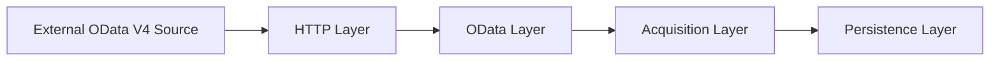

# Architecture

This document describes the internal architecture of the ABAP Cloud OData
Acquisition project.

The focus is not only on retrieving data from an OData endpoint, but also on
the operational behavior around acquisition:

- persistence;
- transaction boundaries;
- run ownership;
- failure handling;
- reconciliation;
- retries;
- concurrency protection.

The architecture intentionally separates transport, OData semantics,
acquisition orchestration, persisted source state, and historical run
information.

---

## High-level architecture

The acquisition flow is divided into four main layers:



In the current implementation these layers are represented by:

```text
HTTP Layer
  ZCL_NW_HTTP_CLIENT

OData Layer
  ZCL_NW_ODATA_CLIENT

Acquisition Layer
  ZCL_NW_ACQUISITION
  ZCL_NW_RUN

Persistence Layer
  ZNW_ACQ_PRODUCT
  ZNW_ACQ_STATE
  ZNW_ACQ_RUN_LOG
```

The main architectural rule is that each layer has a narrow responsibility:

- the HTTP layer knows about transport and HTTP status codes;
- the OData layer knows about URLs, paging and JSON/OData semantics;
- the acquisition layer knows about snapshots, transactions, run state,
  reconciliation and retries;
- the persistence layer stores business data, current source state and run
  history.
