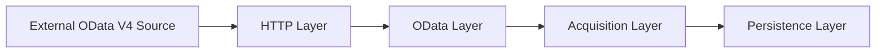
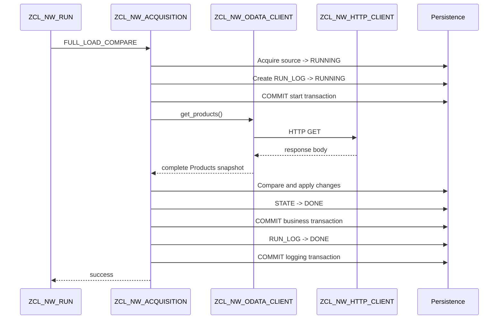
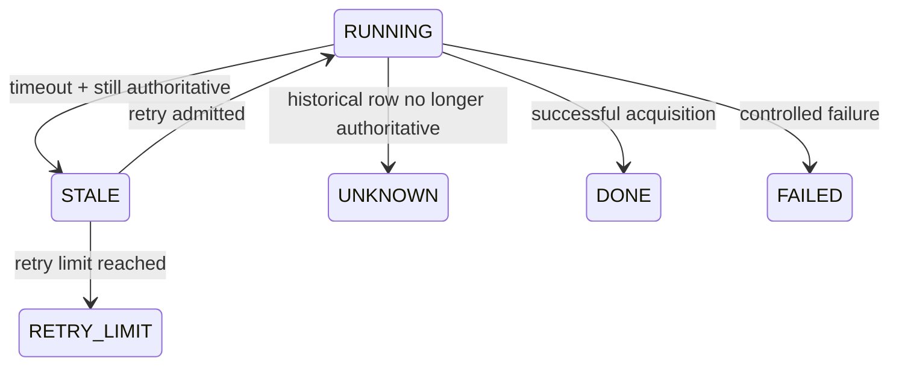

# Architecture

This document describes the internal architecture of the ABAP Cloud OData
Acquisition project.

The focus is not only on retrieving data from an OData endpoint, but also on
the operational behavior around acquisition:

- persistence;
- transaction boundaries;
- run ownership;
- failure handling;
- reconciliation;
- retries;
- concurrency protection.

The architecture intentionally separates transport, OData semantics,
acquisition orchestration, persisted source state, and historical run
information.

---

## High-level architecture

The acquisition flow is divided into four main layers:



In the current implementation these layers are represented by:

```text
HTTP Layer
  ZCL_NW_HTTP_CLIENT

OData Layer
  ZCL_NW_ODATA_CLIENT

Acquisition Layer
  ZCL_NW_ACQUISITION
  ZCL_NW_RUN

Persistence Layer
  ZNW_ACQ_PRODUCT
  ZNW_ACQ_STATE
  ZNW_ACQ_RUN_LOG
```

The main architectural rule is that each layer has a narrow responsibility:

- the HTTP layer knows about transport and HTTP status codes;
- the OData layer knows about URLs, paging and JSON/OData semantics;
- the acquisition layer knows about snapshots, transactions, run state,
  reconciliation and retries;
- the persistence layer stores business data, current source state and run
  history.


---

## Component responsibilities

### `ZCL_NW_HTTP_CLIENT`

Responsible only for low-level HTTP communication.

Main responsibilities:

- create the HTTP destination for the requested URL;
- execute HTTP `GET`;
- read the HTTP status;
- return the response body;
- convert HTTP and transport failures into `ZCX_NW_HTTP_ERROR`.

The class does not know anything about Northwind entities, JSON structures,
paging or persistence.

This keeps transport concerns isolated from OData semantics.

---

### `ZCL_NW_ODATA_CLIENT`

Responsible for OData-specific communication.

Main responsibilities:

- construct the Northwind `Products` request;
- call `ZCL_NW_HTTP_CLIENT`;
- deserialize JSON into the ABAP product structure;
- follow `@odata.nextLink`;
- return the complete logical product collection to the acquisition layer.

The class hides paging from its caller.

From the perspective of `ZCL_NW_ACQUISITION`, one call returns one complete
source snapshot, even if multiple HTTP requests were required.

The OData client does not persist data and does not manage acquisition state.

---

### `ZCL_NW_ACQUISITION`

Contains the main acquisition logic.

Its responsibilities include:

- full snapshot replacement;
- target-side snapshot comparison;
- classification of new, changed, deleted and unchanged records;
- atomic run admission;
- creation of initial run-log records;
- business-data persistence;
- transaction control;
- source-state transitions;
- failure-state persistence;
- reconciliation of interrupted runs;
- creation of retry candidates;
- enforcement of the retry limit.

This class is the main boundary between external-source data and operational
persistence.

---

### `ZCL_NW_RUN`

Provides the normal orchestration entry point.

Its responsibilities are intentionally limited to workflow coordination:

1. reconcile previous incomplete runs;
2. execute an available retry when required;
3. otherwise start a normal acquisition when the current state permits it;
4. present controlled diagnostic output for project-specific exceptions.

Business persistence and state-transition rules remain inside
`ZCL_NW_ACQUISITION`.

---

### Test-support classes

`ZCL_NW_TEST_RUN` is used to prepare controlled persisted-data conditions.

`ZCL_NW_TEST_DRIVER` is used to call individual public acquisition methods
without executing the complete normal runner flow.

These classes are deliberately separated from production orchestration so that
negative and recovery scenarios can be exercised without adding test branches
to the acquisition algorithm itself.

---

## Data model and ownership

The persistence model separates three different concerns:

```text
business snapshot
current operational source state
historical run execution data
```

### `ZNW_ACQ_PRODUCT` — persisted source snapshot

`ZNW_ACQ_PRODUCT` stores the currently persisted representation of the
Northwind `Products` source data.

In the current demo, the persisted business fields include:

- `PRODUCT_ID`
- `PRODUCT_NAME`
- `UNIT_PRICE`

The table represents the current acquisition-layer snapshot.

It does not store run history or operational ownership information.

Its purpose is to answer the question:

```text
What source data is currently persisted?
```

---

### `ZNW_ACQ_STATE` — current operational source state

`ZNW_ACQ_STATE` stores one current operational row per source.

Its purpose is to answer questions such as:

```text
Is this source currently owned by a run?
Which run owns it?
When was the last successful acquisition?
What was the latest successful row count?
Is a retry allowed?
Has the retry limit been reached?
```

Important fields include:

- `SOURCE_NAME`
- `LOAD_TYPE`
- `STATUS`
- `ACTIVE_RUN_ID`
- `LAST_SUCCESS_AT`
- `ROW_COUNT`

`ZNW_ACQ_STATE` is the authoritative source for the current operational state.

It is not intended to preserve the full execution history.

---

### `ZNW_ACQ_RUN_LOG` — historical run history

`ZNW_ACQ_RUN_LOG` stores one row per acquisition execution.

Its purpose is to answer questions such as:

```text
When did this run start?
When did it finish?
Was it successful?
How many rows were processed?
How many records were new, changed or deleted?
Did the run fail?
Was it part of a retry chain?
```

Important fields include:

- `RUN_ID`
- `SOURCE_NAME`
- `LOAD_TYPE`
- `STATUS`
- `STARTED_AT`
- `FINISHED_AT`
- `ROW_COUNT`
- `NEW_COUNT`
- `CHANGED_COUNT`
- `DELETED_COUNT`
- `ERROR_TEXT`
- `ORIGINAL_RUN_ID`
- `RETRY_COUNT`

The run log is historical and append-oriented.

It is not the authoritative source for current ownership of the source.

---

## State ownership

A central design decision is that source state and run history are related but
not interchangeable.

For example, a historical run may still contain:

```text
RUN_LOG.STATUS = RUNNING
```

while `ZNW_ACQ_STATE` shows that a different run is now authoritative.

In this situation the old run-log row is not treated as the current owner.

During reconciliation, such a historical row is classified as:

```text
UNKNOWN
```

because its final result cannot be reconstructed reliably from the historical
record alone.

The current source state remains authoritative for ownership decisions.

---

## `ACTIVE_RUN_ID`

`ACTIVE_RUN_ID` links the current source state to the run that currently owns
or controls the next recovery action for that source.

Its meaning depends on the source state.

### When `STATUS = RUNNING`

```text
ACTIVE_RUN_ID = currently executing run
```

### When `STATUS = STALE`

```text
ACTIVE_RUN_ID = exact stale run awaiting retry evaluation
```

The ID is intentionally preserved when `RUNNING` becomes `STALE`.

This allows a later reconciliation execution to identify the correct stale run
without relying on in-memory state from the previous process.

### When `STATUS = DONE`, `FAILED` or `RETRY_LIMIT`

`ACTIVE_RUN_ID` is cleared.

No run currently owns the source.

---

## Why state and history are separate

A single table could theoretically contain both current state and historical
execution information, but that would mix two different responsibilities.

The current design keeps them separate:

```text
ZNW_ACQ_STATE
  one row per source
  mutable
  current operational truth

ZNW_ACQ_RUN_LOG
  one row per run
  historical
  execution evidence
```

This separation simplifies:

- run admission;
- current ownership checks;
- recovery after interruption;
- retry-chain reconstruction;
- historical diagnostics;
- reconciliation of inconsistent historical records.

---

## Acquisition flow

A normal acquisition follows a defined sequence from run admission to final
run-log completion.

### 1. Create a new run identity

A new UUID-based `RUN_ID` is generated together with the run start timestamp.

At this point, the run exists only in memory and has not yet been persisted.

### 2. Acquire the source

The acquisition attempts to claim the source according to the run-admission
rules.

For a normal run, an existing source state may be acquired only from:

```text
DONE
FAILED
```

If no state row exists yet, the acquisition attempts to create the initial
source-state row.

For a retry run, acquisition is allowed only from:

```text
STALE
```

After successful admission, the source state becomes:

```text
STATUS        = RUNNING
ACTIVE_RUN_ID = <new RUN_ID>
LOAD_TYPE     = COMPARE
```

The admission logic uses conditional database operations so that source
ownership is decided atomically by the database transaction.

### 3. Create the initial run-log record

After source ownership has been acquired, an initial historical run record is
created:

```text
RUN_ID      = <new RUN_ID>
SOURCE_NAME = NORTHWIND_PRODUCTS
LOAD_TYPE   = COMPARE
STATUS      = RUNNING
STARTED_AT  = <timestamp>
```

The source-state change and creation of the initial `RUN_LOG` record belong to
the same logical unit of work.

If the initial run-log record cannot be created, the complete start
transaction is rolled back.

### 4. Commit the start transaction

The start transaction is committed before the external OData request is
executed.

After this commit, an interrupted or hanging run is visible to later
executions through:

```text
ZNW_ACQ_STATE
ZNW_ACQ_RUN_LOG
```

This makes stale-run detection and recovery possible.

### 5. Read the source snapshot

`ZCL_NW_ODATA_CLIENT` retrieves the complete logical `Products` snapshot.

Paging is handled internally through `@odata.nextLink`.

From the perspective of the acquisition layer, the result is one complete
source snapshot even if several HTTP requests were required.

If the external request fails, the current source state and current run-log
record are persisted as `FAILED` before the HTTP exception is propagated.

### 6. Compare source and persisted snapshots

For `FULL_LOAD_COMPARE`, the source snapshot is compared with the currently
persisted target snapshot.

Records are classified as:

```text
NEW
CHANGED
DELETED
UNCHANGED
```

Hashed internal tables are used for lookup by product ID.

Only detected business changes are prepared for persistence.

### 7. Apply business changes

Detected changes are applied in one business transaction:

```text
INSERT new rows
MODIFY changed rows
DELETE removed rows
```

In the same transaction, the source state is updated to:

```text
STATUS          = DONE
ACTIVE_RUN_ID   = initial
LAST_SUCCESS_AT = <current timestamp>
ROW_COUNT       = <source row count>
```

If an Open SQL error occurs, the complete business transaction is rolled back.

After rollback, the failure state is persisted separately:

```text
STATE.STATUS   = FAILED
RUN_LOG.STATUS = FAILED
```

### 8. Commit successful acquisition state

Business data and successful source state are committed together.

At this point, the acquisition itself is considered successful.

A later logging failure must not roll back the already committed business
result.

### 9. Finalize the run log

The historical run record is finalized in a separate logical unit of work.

A successful run records:

```text
STATUS         = DONE
FINISHED_AT    = <timestamp>
ROW_COUNT      = <source row count>
NEW_COUNT      = <number of new records>
CHANGED_COUNT  = <number of changed records>
DELETED_COUNT  = <number of deleted records>
```

If this final logging transaction fails, the successful business acquisition
remains committed.

Reconciliation can later identify a historical run-log record that no longer
matches the authoritative current source state.

---

## Normal acquisition sequence

The successful normal flow can be summarized as:



The sequence diagram represents the successful path.

Failure and recovery paths use the same transaction boundaries but transition
the operational source state and historical run state according to the
relevant exception or reconciliation rule.


---

## Run admission and concurrency

The acquisition design enforces the following invariant:

```text
For one SOURCE_NAME, at most one run may own the source at a time.
```

This invariant is implemented at the database-transaction level.

### Normal-run admission

A normal run is allowed when:

```text
no source-state row exists
or
STATUS = DONE
or
STATUS = FAILED
```

For an existing source-state row, acquisition uses a conditional update:

```text
UPDATE source state
WHERE SOURCE_NAME = <source>
  AND STATUS IN (DONE, FAILED)
```

The update succeeds only if the persisted state still satisfies the admission
condition at the moment the database operation is executed.

If no state row exists, the acquisition attempts to create the initial source
state.

The source-state key ensures that only one concurrent session can successfully
create the row for the same source.

### Retry admission

A retry run is admitted only from:

```text
STATUS = STALE
```

The retry path uses a conditional update requiring the persisted state to
still be `STALE`.

This prevents a retry from starting after another process has already changed
the operational state.

---

## Why `SELECT` followed by `UPDATE` is not sufficient

A non-atomic implementation could use:

```text
Session A: SELECT state -> available
Session B: SELECT state -> available

Session A: UPDATE state -> RUNNING
Session B: UPDATE state -> RUNNING
```

Both sessions could make their decision from the same previously observed
state.

The current implementation avoids this decision gap by putting the admission
condition directly into the database modification.

The database therefore decides which session successfully acquires the source.

---

## First-run race condition

The first run is a special case because no source-state row exists yet.

Two concurrent sessions may both determine that no admissible existing row
was updated and then attempt to create the initial state.

The unique source-state key and database locking serialize these inserts.

The observed concurrent behavior is:

```text
Session A
  INSERT initial STATE
  holds uncommitted database lock

Session B
  attempts acquisition
  waits for the conflicting database operation

Session A
  creates initial RUN_LOG
  COMMIT

Session B
  resumes
  observes persisted STATE = RUNNING
  admission is rejected
```

Only Session A obtains source ownership.

Session B does not create an initial `RUN_LOG` record and does not reach the
external OData request.

---

## Admission failure classification

A failed admission attempt re-reads the persisted source state before
constructing the project-specific exception.

This is important because local work-area values may contain data prepared for
an unsuccessful insert attempt and must not be treated as authoritative.

After re-reading the persisted state:

### Current state is `RUNNING`

The acquisition raises:

```text
ZCX_NW_RUN_ACTIVE
```

The exception identifies:

```text
SOURCE_NAME
ACTIVE_RUN_ID
```

This means another run genuinely owns the source.

### Current state is not `RUNNING`

The acquisition raises:

```text
ZCX_NW_RUN_NOT_ALLOWED
```

The exception identifies:

```text
SOURCE_NAME
STATE_STATUS
REQUESTED_MODE
```

Typical examples include:

```text
NORMAL requested from STALE
NORMAL requested from RETRY_LIMIT
RETRY requested from DONE
RETRY requested from FAILED
```

This separation keeps concurrency conflicts distinct from state-machine
transition rejections.


---

## Transaction boundaries and consistency

The acquisition flow uses several explicit logical units of work.

The transaction boundaries are designed around one principle:

```text
Business state must never become inconsistent with acquisition state.
```

At the same time, already committed business data must not be rolled back
because of a later logging failure.

The implementation therefore separates the acquisition into three main
transactions.

---

### 1. Start transaction

The start transaction establishes run ownership and creates the initial
historical run record.

It contains:

```text
STATE -> RUNNING
ACTIVE_RUN_ID -> new RUN_ID

RUN_LOG -> RUNNING
STARTED_AT -> current timestamp
```

Both changes are committed together.

The required invariant is:

```text
A persisted RUNNING source must have a corresponding initial RUN_LOG record.
```

If creation of the initial `RUN_LOG` record fails, the entire start
transaction is rolled back.

The source is therefore not left in:

```text
STATE.STATUS = RUNNING
```

without historical evidence of the run that acquired it.

---

### 2. Business transaction

After the external snapshot has been read and compared, detected business
changes are applied together with the successful source-state update.

The transaction contains:

```text
INSERT new business rows
MODIFY changed business rows
DELETE removed business rows

STATE.STATUS          -> DONE
STATE.ACTIVE_RUN_ID   -> initial
STATE.LAST_SUCCESS_AT -> current timestamp
STATE.ROW_COUNT       -> source row count
```

All of these changes are committed together.

The required invariant is:

```text
Persisted business snapshot and successful acquisition state must represent
the same completed acquisition.
```

If an Open SQL error occurs before commit:

```text
ROLLBACK WORK
```

cancels all business changes from the current LUW.

After rollback, a separate failure transaction records:

```text
STATE.STATUS   = FAILED
RUN_LOG.STATUS = FAILED
```

The previously committed successful snapshot therefore remains unchanged.

---

### 3. Final logging transaction

After the business transaction has committed successfully, the historical run
record is finalized separately.

Typical final values include:

```text
RUN_LOG.STATUS        = DONE
RUN_LOG.FINISHED_AT   = <timestamp>
RUN_LOG.ROW_COUNT     = <source row count>
RUN_LOG.NEW_COUNT     = <count>
RUN_LOG.CHANGED_COUNT = <count>
RUN_LOG.DELETED_COUNT = <count>
```

This update belongs to a separate LUW.

The separation is intentional.

If final logging fails, the already committed business snapshot and successful
source state remain valid.

The system does not roll back successful business work merely because
observability data could not be finalized.

---

## Why logging is committed separately

The following sequence is possible:

```text
Business transaction -> COMMIT successful
Final RUN_LOG update  -> failure
```

At this point the source data has already been persisted correctly.

Rolling it back because the logging step failed would create a larger
operational problem than the logging inconsistency itself.

The architecture therefore treats:

```text
business correctness
```

and:

```text
historical observability
```

as related but different concerns.

A later reconciliation execution can detect that a historical run still
appears as `RUNNING` even though the current source state shows that it is no
longer authoritative.

Such a historical run can be classified as:

```text
UNKNOWN
```

without invalidating the previously committed business acquisition.

---

## Failure-state transaction

Failure-state persistence is intentionally performed after rollback of the
failed business LUW.

The sequence is:

```text
business database error
        |
        v
ROLLBACK business LUW
        |
        v
STATE -> FAILED
RUN_LOG -> FAILED
        |
        v
COMMIT failure information
```

This prevents partially applied business data from being committed together
with a failure status.

The failure record describes the failed attempt, while the previous successful
business snapshot remains intact.

---

## Transaction invariants

The transaction design protects the following invariants.

### Start invariant

```text
RUNNING source state
<=>
corresponding initial RUN_LOG exists
```

### Success invariant

```text
STATE = DONE
<=>
business changes of that acquisition were committed
```

### Failure invariant

```text
STATE = FAILED
=>
business changes of the failed LUW were rolled back
```

### Logging-failure invariant

```text
successful business commit
must not be undone
by a later RUN_LOG finalization failure
```

These invariants are verified by the negative and recovery scenarios described
in `docs/testing.md`.


---

## Reconciliation and retry architecture

Reconciliation is responsible for recovering acquisition state after an
execution was interrupted or left incomplete.

The design assumes that a process may stop at any point after the initial
start transaction has been committed.

For this reason, recovery must depend on persisted database state rather than
on in-memory information from the previous execution.

---

### Detecting stale runs

A historical run is considered for reconciliation when:

```text
RUN_LOG.STATUS = RUNNING
```

and:

```text
STARTED_AT < current time - stale timeout
```

The stale timeout is controlled by:

```text
c_stale_timeout_minutes
```

A historical `RUNNING` row alone is not sufficient to prove that the run still
owns the source.

The current authoritative source state must also be checked.

---

### Phase 1 — classify old `RUNNING` records

For every historical run that exceeded the stale timeout,
`RECONCILE_RUNS` reads the corresponding current source state.

Two cases are possible.

#### Case 1 — the run is still authoritative

If:

```text
STATE.STATUS        = RUNNING
STATE.ACTIVE_RUN_ID = RUN_LOG.RUN_ID
```

then the run is still the authoritative owner recorded for the source.

Because it exceeded the allowed runtime, it is reclassified as stale:

```text
RUN_LOG.STATUS = STALE
STATE.STATUS   = STALE
```

`ACTIVE_RUN_ID` is intentionally preserved.

The resulting state is:

```text
STATE.STATUS        = STALE
STATE.ACTIVE_RUN_ID = <stale RUN_ID>
```

This identifies exactly which stale run is waiting for retry evaluation.

#### Case 2 — the historical run is no longer authoritative

If the source state no longer points to that historical `RUNNING` row, the
run cannot be treated as active.

Its final execution result is not known reliably, so the historical record is
classified as:

```text
RUN_LOG.STATUS = UNKNOWN
```

The current source state is not replaced by this historical record.

This keeps current ownership authoritative even when historical logging is
incomplete.

---

### Why `ACTIVE_RUN_ID` is preserved for `STALE`

A stale run is no longer considered a normally active acquisition, but it
still controls the next recovery decision.

Therefore:

```text
RUNNING -> STALE
```

does not clear `ACTIVE_RUN_ID`.

Instead:

```text
ACTIVE_RUN_ID = exact stale RUN_ID
```

remains persisted until one of the following happens:

```text
retry starts
retry limit is reached
state is otherwise resolved
```

This prevents reconciliation from selecting an arbitrary historical `STALE`
record.

---

### Phase 2 — reconstruct retry candidates

Retry candidates are created from the persisted source state rather than only
from runs that became stale during the current reconciliation call.

The logic starts from:

```text
STATE.STATUS        = STALE
STATE.ACTIVE_RUN_ID = <stale RUN_ID>
```

The corresponding historical run is then selected using:

```text
RUN_LOG.RUN_ID = STATE.ACTIVE_RUN_ID
RUN_LOG.STATUS = STALE
```

If the stale run is still below the configured retry limit, it becomes a
retry candidate.

This design makes reconciliation restart-safe.

---

## Restart-safe recovery

Consider the following sequence:

```text
Process A
  detects old RUNNING
  changes RUN_LOG -> STALE
  changes STATE   -> STALE
  COMMIT

Process A stops before starting the retry
```

If retry candidates existed only in memory, the retry opportunity would be
lost when Process A stopped.

Instead, the persisted state contains:

```text
STATE.STATUS        = STALE
STATE.ACTIVE_RUN_ID = <stale RUN_ID>
```

A later Process B can reconstruct the retry candidate from the database and
continue recovery.

This is the reason reconciliation is intentionally divided into two phases.

---

## Retry chains

Retries are linked into one logical chain.

The first run is the root run.

For the initial execution:

```text
RETRY_COUNT     = 0
ORIGINAL_RUN_ID = initial
```

For the first retry:

```text
RETRY_COUNT     = 1
ORIGINAL_RUN_ID = <root RUN_ID>
```

Further retries preserve the same root identifier:

```text
Run A
  retry_count     = 0
  original_run_id = initial

Run B
  retry_count     = 1
  original_run_id = A

Run C
  retry_count     = 2
  original_run_id = A

Run D
  retry_count     = 3
  original_run_id = A
```

`ORIGINAL_RUN_ID` therefore identifies the retry chain, while `RUN_ID`
identifies one concrete execution.

---

## Starting a retry

A retry is not treated as a new normal run.

Retry admission requires:

```text
STATE.STATUS = STALE
```

The retry acquisition changes the source back to:

```text
STATUS        = RUNNING
ACTIVE_RUN_ID = <new retry RUN_ID>
```

The new retry receives its own `RUN_ID`, while the retry-chain relationship is
stored through:

```text
ORIGINAL_RUN_ID
RETRY_COUNT
```

This preserves both:

```text
individual execution identity
and
logical retry-chain identity
```

---

## Retry limit

The maximum automatic retry count is controlled by:

```text
c_max_retry_count
```

If the stale run has already reached the configured maximum, no new retry
candidate is returned.

Instead, the source state becomes:

```text
STATUS        = RETRY_LIMIT
ACTIVE_RUN_ID = initial
```

At this point automatic recovery stops.

A normal run is also rejected while the source remains in `RETRY_LIMIT`.

This prevents the retry limit from being bypassed through the normal
acquisition path.

---

## Reconciliation state transitions

The main recovery transitions can be summarized as:



`UNKNOWN` belongs to historical run state rather than to the normal current
source-state lifecycle.

The current source state remains authoritative for admission and ownership
decisions.


---

## Error propagation and exception boundaries

The project uses explicit checked exceptions to keep failure propagation
visible across architectural layers.

The goal is to avoid leaking low-level technical exceptions directly into the
normal orchestration flow.

---

### HTTP and transport failures

Low-level HTTP communication is handled by:

```text
ZCL_NW_HTTP_CLIENT
```

This layer converts HTTP and transport failures into:

```text
ZCX_NW_HTTP_ERROR
```

The exception carries:

```text
STATUS_CODE
REASON
```

For a normal HTTP failure, `STATUS_CODE` contains the returned HTTP status.

For a transport-level failure where no HTTP response exists:

```text
STATUS_CODE = 0
```

and `REASON` contains the technical communication error.

The exception then propagates through:

```text
ZCL_NW_HTTP_CLIENT
        ->
ZCL_NW_ODATA_CLIENT
        ->
ZCL_NW_ACQUISITION
        ->
ZCL_NW_RUN
```

The intermediate layers either declare or explicitly handle the checked
exception.

This makes the exception contract visible at each architectural boundary.

---

### Acquisition-layer HTTP handling

The acquisition layer does not simply pass an HTTP failure upward.

Before re-raising the original `ZCX_NW_HTTP_ERROR`, it persists the failed
operational state:

```text
STATE.STATUS        = FAILED
STATE.ACTIVE_RUN_ID = initial

RUN_LOG.STATUS      = FAILED
RUN_LOG.FINISHED_AT = <timestamp>
RUN_LOG.ERROR_TEXT  = <HTTP diagnostic>
```

The failure state is committed before the exception leaves the acquisition
layer.

This ensures that a controlled external-source failure is visible both to the
caller and in persistent operational history.

---

### Database failures

Open SQL failures are handled close to the transaction boundary where they
occur.

Technical exceptions such as:

```text
CX_SY_OPEN_SQL_DB
```

are converted into:

```text
ZCX_NW_DB_ERROR
```

The conversion prevents database-specific exception types from becoming part
of the public orchestration contract.

The acquisition layer is responsible for performing the required rollback
before raising the project-specific database exception.

---

### Run ownership conflicts

A run-admission failure is classified after re-reading the authoritative
persisted source state.

If the source is genuinely owned by another active run:

```text
STATE.STATUS = RUNNING
```

the acquisition raises:

```text
ZCX_NW_RUN_ACTIVE
```

The exception contains:

```text
SOURCE_NAME
ACTIVE_RUN_ID
```

This represents an actual concurrency or ownership conflict.

---

### State-machine transition rejection

If admission fails for a state that is not `RUNNING`, the acquisition raises:

```text
ZCX_NW_RUN_NOT_ALLOWED
```

The exception contains:

```text
SOURCE_NAME
STATE_STATUS
REQUESTED_MODE
```

Typical examples include:

```text
NORMAL requested from STALE
NORMAL requested from RETRY_LIMIT
RETRY requested from DONE
RETRY requested from FAILED
```

This separates:

```text
another run currently owns the source
```

from:

```text
the requested transition is not allowed by the state machine
```

---

## Exception responsibility by layer

The main exception boundaries can be summarized as:

| Layer | Responsibility |
|---|---|
| `ZCL_NW_HTTP_CLIENT` | Convert HTTP / transport failures into `ZCX_NW_HTTP_ERROR` |
| `ZCL_NW_ODATA_CLIENT` | Propagate OData acquisition failures explicitly |
| `ZCL_NW_ACQUISITION` | Persist failure state, rollback DB work, classify admission failures |
| `ZCL_NW_RUN` | Catch project-specific exceptions and present controlled diagnostics |

---

## Why checked exceptions are used

The project uses checked exceptions deliberately.

The acquisition flow crosses several layers and contains multiple failure
categories:

```text
transport
OData
database
run ownership
state-machine admission
```

Using checked exceptions requires each intermediate method to either:

```text
handle the failure
```

or:

```text
declare it in RAISING
```

This makes failure propagation part of the visible interface rather than an
implicit runtime behavior.

The approach is especially useful in a data-acquisition pipeline where missing
exception propagation could otherwise convert a controlled operational failure
into an unexpected runtime termination.


---

## Design decisions and trade-offs

The project intentionally favors explicit operational behavior over minimal
implementation size.

Several design decisions are worth highlighting because they shape the
architecture of the acquisition flow.

### Full snapshot comparison instead of simulated delta

`FULL_LOAD_COMPARE` reads the complete source snapshot and compares it with the
persisted target snapshot.

This reduces target-side database changes, but it does not reduce source-side
API volume.

The project deliberately does not simulate a delta mechanism that the source
does not actually provide.

A future implementation should use a genuine source-side delta mechanism when
the source supports one, for example:

```text
opaque delta token
timestamp
monotonically increasing sequence
change version
```

The current Northwind scenario therefore demonstrates snapshot comparison,
not native delta extraction.

---

### Separate current state from historical run data

`ZNW_ACQ_STATE` and `ZNW_ACQ_RUN_LOG` are intentionally separate.

The source-state table answers:

```text
What is the current operational truth for this source?
```

The run-log table answers:

```text
What happened during this specific execution?
```

This separation makes it possible for the current source state to remain
authoritative even when historical logging is incomplete or inconsistent.

It also allows reconciliation to classify historical rows without changing
current ownership incorrectly.

---

### Persist run ownership before external I/O

The initial source state and initial run-log record are committed before the
external OData request is executed.

This makes a run visible even if the process later:

```text
hangs
is interrupted
loses connectivity
terminates unexpectedly
```

Without this early start transaction, later executions would have no durable
evidence that the source had been acquired.

The trade-off is that reconciliation is required to clean up runs that remain
in `RUNNING`.

---

### Preserve `ACTIVE_RUN_ID` for `STALE`

When an authoritative `RUNNING` run becomes `STALE`, its `ACTIVE_RUN_ID` is not
cleared immediately.

This is intentional.

The ID identifies the exact stale run that controls the next retry decision.

Clearing it at the `STALE` transition would require reconciliation to search
historical stale rows and could make retry-chain selection ambiguous.

The field is cleared only when the source is no longer awaiting recovery.

---

### Separate business success from final logging success

The business transaction and final run-log transaction are intentionally
separate.

Once business data and successful source state are committed, a later logging
failure does not invalidate that business result.

This design prefers:

```text
correct persisted business data
+
temporarily incomplete observability
```

over:

```text
rolling back valid business data
because monitoring data failed
```

The trade-off is that reconciliation must be able to detect historical
run-log inconsistencies.

---

### Explicit retry chains

Each retry receives its own `RUN_ID`.

The retry relationship is preserved separately through:

```text
ORIGINAL_RUN_ID
RETRY_COUNT
```

This keeps two concepts distinct:

```text
one concrete execution
one logical retry chain
```

It also makes retry history easier to inspect and prevents a retry from
overwriting the identity of the original run.

---

### Database-level admission instead of application-only checks

The one-active-run rule is enforced through conditional database operations,
unique source-state ownership, and normal database locking.

The design does not rely only on:

```text
SELECT state
decide in application code
UPDATE later
```

because that creates a race window between observation and modification.

The database participates directly in the ownership decision.

The two-session concurrency test confirmed this behavior under a real race
condition.

---

### Checked exceptions as part of the architecture

Project-specific checked exceptions are used deliberately to make failure
propagation visible.

This increases interface verbosity because intermediate methods must declare
or handle exceptions explicitly.

The benefit is that failure categories remain part of the method contract
across architectural layers.

For this project, that trade-off is appropriate because acquisition failures
have persistent operational consequences.

---

## Architectural scope

The current implementation is intentionally focused on one source:

```text
NORTHWIND_PRODUCTS
```

and one acquisition scenario.

The project is therefore not presented as a generic acquisition framework.

Its purpose is to demonstrate the operational design patterns clearly:

```text
layered external acquisition
snapshot persistence
explicit transaction boundaries
current-state ownership
historical run logging
reconciliation
retry chains
concurrency protection
controlled failure propagation
```

A future refactoring could generalize source configuration and reusable
acquisition infrastructure, but that is kept outside the current scope to
avoid hiding the core behavior behind premature abstraction.
