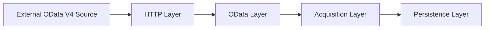

# Architecture

This document describes the internal architecture of the ABAP Cloud OData
Acquisition project.

The focus is not only on retrieving data from an OData endpoint, but also on
the operational behavior around acquisition:

- persistence;
- transaction boundaries;
- run ownership;
- failure handling;
- reconciliation;
- retries;
- concurrency protection.

The architecture intentionally separates transport, OData semantics,
acquisition orchestration, persisted source state, and historical run
information.

---

## High-level architecture

The acquisition flow is divided into four main layers:



In the current implementation these layers are represented by:

```text
HTTP Layer
  ZCL_NW_HTTP_CLIENT

OData Layer
  ZCL_NW_ODATA_CLIENT

Acquisition Layer
  ZCL_NW_ACQUISITION
  ZCL_NW_RUN

Persistence Layer
  ZNW_ACQ_PRODUCT
  ZNW_ACQ_STATE
  ZNW_ACQ_RUN_LOG
```

The main architectural rule is that each layer has a narrow responsibility:

- the HTTP layer knows about transport and HTTP status codes;
- the OData layer knows about URLs, paging and JSON/OData semantics;
- the acquisition layer knows about snapshots, transactions, run state,
  reconciliation and retries;
- the persistence layer stores business data, current source state and run
  history.


---

## Component responsibilities

### `ZCL_NW_HTTP_CLIENT`

Responsible only for low-level HTTP communication.

Main responsibilities:

- create the HTTP destination for the requested URL;
- execute HTTP `GET`;
- read the HTTP status;
- return the response body;
- convert HTTP and transport failures into `ZCX_NW_HTTP_ERROR`.

The class does not know anything about Northwind entities, JSON structures,
paging or persistence.

This keeps transport concerns isolated from OData semantics.

---

### `ZCL_NW_ODATA_CLIENT`

Responsible for OData-specific communication.

Main responsibilities:

- construct the Northwind `Products` request;
- call `ZCL_NW_HTTP_CLIENT`;
- deserialize JSON into the ABAP product structure;
- follow `@odata.nextLink`;
- return the complete logical product collection to the acquisition layer.

The class hides paging from its caller.

From the perspective of `ZCL_NW_ACQUISITION`, one call returns one complete
source snapshot, even if multiple HTTP requests were required.

The OData client does not persist data and does not manage acquisition state.

---

### `ZCL_NW_ACQUISITION`

Contains the main acquisition logic.

Its responsibilities include:

- full snapshot replacement;
- target-side snapshot comparison;
- classification of new, changed, deleted and unchanged records;
- atomic run admission;
- creation of initial run-log records;
- business-data persistence;
- transaction control;
- source-state transitions;
- failure-state persistence;
- reconciliation of interrupted runs;
- creation of retry candidates;
- enforcement of the retry limit.

This class is the main boundary between external-source data and operational
persistence.

---

### `ZCL_NW_RUN`

Provides the normal orchestration entry point.

Its responsibilities are intentionally limited to workflow coordination:

1. reconcile previous incomplete runs;
2. execute an available retry when required;
3. otherwise start a normal acquisition when the current state permits it;
4. present controlled diagnostic output for project-specific exceptions.

Business persistence and state-transition rules remain inside
`ZCL_NW_ACQUISITION`.

---

### Test-support classes

`ZCL_NW_TEST_RUN` is used to prepare controlled persisted-data conditions.

`ZCL_NW_TEST_DRIVER` is used to call individual public acquisition methods
without executing the complete normal runner flow.

These classes are deliberately separated from production orchestration so that
negative and recovery scenarios can be exercised without adding test branches
to the acquisition algorithm itself.

---

## Data model and ownership

The persistence model separates three different concerns:

```text
business snapshot
current operational source state
historical run execution data
```

### `ZNW_ACQ_PRODUCT` — persisted source snapshot

`ZNW_ACQ_PRODUCT` stores the currently persisted representation of the
Northwind `Products` source data.

In the current demo, the persisted business fields include:

- `PRODUCT_ID`
- `PRODUCT_NAME`
- `UNIT_PRICE`

The table represents the current acquisition-layer snapshot.

It does not store run history or operational ownership information.

Its purpose is to answer the question:

```text
What source data is currently persisted?
```

---

### `ZNW_ACQ_STATE` — current operational source state

`ZNW_ACQ_STATE` stores one current operational row per source.

Its purpose is to answer questions such as:

```text
Is this source currently owned by a run?
Which run owns it?
When was the last successful acquisition?
What was the latest successful row count?
Is a retry allowed?
Has the retry limit been reached?
```

Important fields include:

- `SOURCE_NAME`
- `LOAD_TYPE`
- `STATUS`
- `ACTIVE_RUN_ID`
- `LAST_SUCCESS_AT`
- `ROW_COUNT`

`ZNW_ACQ_STATE` is the authoritative source for the current operational state.

It is not intended to preserve the full execution history.

---

### `ZNW_ACQ_RUN_LOG` — historical run history

`ZNW_ACQ_RUN_LOG` stores one row per acquisition execution.

Its purpose is to answer questions such as:

```text
When did this run start?
When did it finish?
Was it successful?
How many rows were processed?
How many records were new, changed or deleted?
Did the run fail?
Was it part of a retry chain?
```

Important fields include:

- `RUN_ID`
- `SOURCE_NAME`
- `LOAD_TYPE`
- `STATUS`
- `STARTED_AT`
- `FINISHED_AT`
- `ROW_COUNT`
- `NEW_COUNT`
- `CHANGED_COUNT`
- `DELETED_COUNT`
- `ERROR_TEXT`
- `ORIGINAL_RUN_ID`
- `RETRY_COUNT`

The run log is historical and append-oriented.

It is not the authoritative source for current ownership of the source.

---

## State ownership

A central design decision is that source state and run history are related but
not interchangeable.

For example, a historical run may still contain:

```text
RUN_LOG.STATUS = RUNNING
```

while `ZNW_ACQ_STATE` shows that a different run is now authoritative.

In this situation the old run-log row is not treated as the current owner.

During reconciliation, such a historical row is classified as:

```text
UNKNOWN
```

because its final result cannot be reconstructed reliably from the historical
record alone.

The current source state remains authoritative for ownership decisions.

---

## `ACTIVE_RUN_ID`

`ACTIVE_RUN_ID` links the current source state to the run that currently owns
or controls the next recovery action for that source.

Its meaning depends on the source state.

### When `STATUS = RUNNING`

```text
ACTIVE_RUN_ID = currently executing run
```

### When `STATUS = STALE`

```text
ACTIVE_RUN_ID = exact stale run awaiting retry evaluation
```

The ID is intentionally preserved when `RUNNING` becomes `STALE`.

This allows a later reconciliation execution to identify the correct stale run
without relying on in-memory state from the previous process.

### When `STATUS = DONE`, `FAILED` or `RETRY_LIMIT`

`ACTIVE_RUN_ID` is cleared.

No run currently owns the source.

---

## Why state and history are separate

A single table could theoretically contain both current state and historical
execution information, but that would mix two different responsibilities.

The current design keeps them separate:

```text
ZNW_ACQ_STATE
  one row per source
  mutable
  current operational truth

ZNW_ACQ_RUN_LOG
  one row per run
  historical
  execution evidence
```

This separation simplifies:

- run admission;
- current ownership checks;
- recovery after interruption;
- retry-chain reconstruction;
- historical diagnostics;
- reconciliation of inconsistent historical records.
